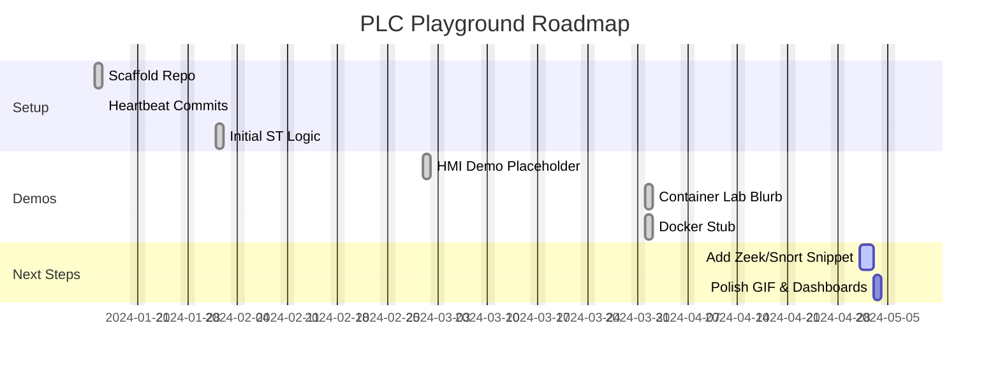

# hobby-plc-playground

> A simple soft-PLC setup using OpenPLC + Factory IO conveyor sim.
I wrote some ladder logic to sort boxes by size.

## HMI Demo

_A quick loop of the conveyor HMI in action, March 2024._

## Container Lab

A quick Docker Compose setup to spin up a soft-PLC (OpenPLC), an MQTT broker, and Grafana for easy IIoT 
testing. Perfect for tinkering with PLC-to-dashboard data flows.

## Project Planner

